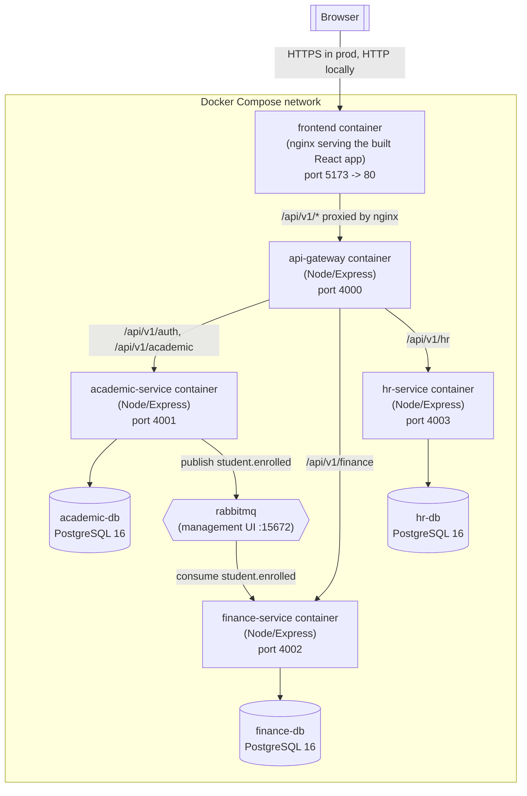

# Architecture & Deployment Diagram

## Deployment diagram

## Why this shape

- **Frontend never calls a microservice directly.** It only ever calls the
  API Gateway (`/api/v1/...`), which is the single public entry point,
  handles routing, JWT verification at the edge, rate limiting, and API
  versioning.
- **Database-per-service.** `academic_db`, `finance_db`, and `hr_db` are
  three separate PostgreSQL instances (see [docs/erd/erd.md](./erd/erd.md)).
  No service reaches into another service's database or tables.
- **Identity lives in the Academic Service.** Rather than inventing a fourth
  "auth service" that the assignment's architecture diagram does not call
  for, the `users`/`refresh_tokens` tables live in `academic_db` (every
  role - Super Admin, Admin, Staff, Student - is fundamentally a member of
  the academic institution). The gateway proxies `/api/v1/auth/*` straight
  through to the Academic Service's `/auth` routes. Finance and HR never see
  a password; they independently verify the JWT using the same shared
  `JWT_ACCESS_SECRET`, so both remain safe to call directly, bypassing the
  gateway (defense in depth for authorization).
- **RabbitMQ carries exactly one required cross-service workflow**: when a
  student enrolls, the Academic Service publishes `student.enrolled` on a
  durable topic exchange; the Finance Service consumes it idempotently and
  creates a tuition invoice. See
  [docs/uml/sequence-enrollment-to-invoice.md](./uml/sequence-enrollment-to-invoice.md).

## Service communication summary

| Caller | Callee | Protocol | Notes |
|---|---|---|---|
| Browser | frontend (nginx) | HTTP | Serves the built React SPA |
| frontend | api-gateway | HTTP, `/api/v1/*` | Proxied by nginx (Docker) or Vite dev server (local dev) |
| api-gateway | academic/finance/hr-service | HTTP | `http-proxy-middleware`, JWT forwarded via `Authorization` header |
| academic-service | RabbitMQ | AMQP | Publishes `student.enrolled` |
| finance-service | RabbitMQ | AMQP | Consumes `student.enrolled`, creates invoice |
| each service | its own PostgreSQL | TCP/SQL | `pg` driver, raw parameterized SQL |

## Known simplifications (declared per the assignment's honesty requirement)

- Mobile-money payments are **simulated** (`services/finance-service/src/services/mockPaymentGateway.js`)
  - no real telecom API is called and no real money moves.
  - a phone number ending in `0000` is a deterministic "declined" test case.
- CNPS/PAYE payroll rates are **configurable placeholders**
  (`hr_db.payroll_config`), not verified against current legislation - see
  `services/hr-service/src/services/payrollService.js`.
- Tuition pricing is a flat per-credit-hour rate (`PER_CREDIT_TUITION_FCFA`
  env var), not a real program-specific fee schedule.
- PDF export for transcripts/reports is not implemented in this build; JSON
  data for all reports is available and could be piped into a PDF renderer
  as a follow-up.
- The enrollment -> RabbitMQ publish is fire-and-forget (no outbox pattern);
  documented as a known gap in
  [docs/uml/sequence-enrollment-to-invoice.md](./uml/sequence-enrollment-to-invoice.md).
