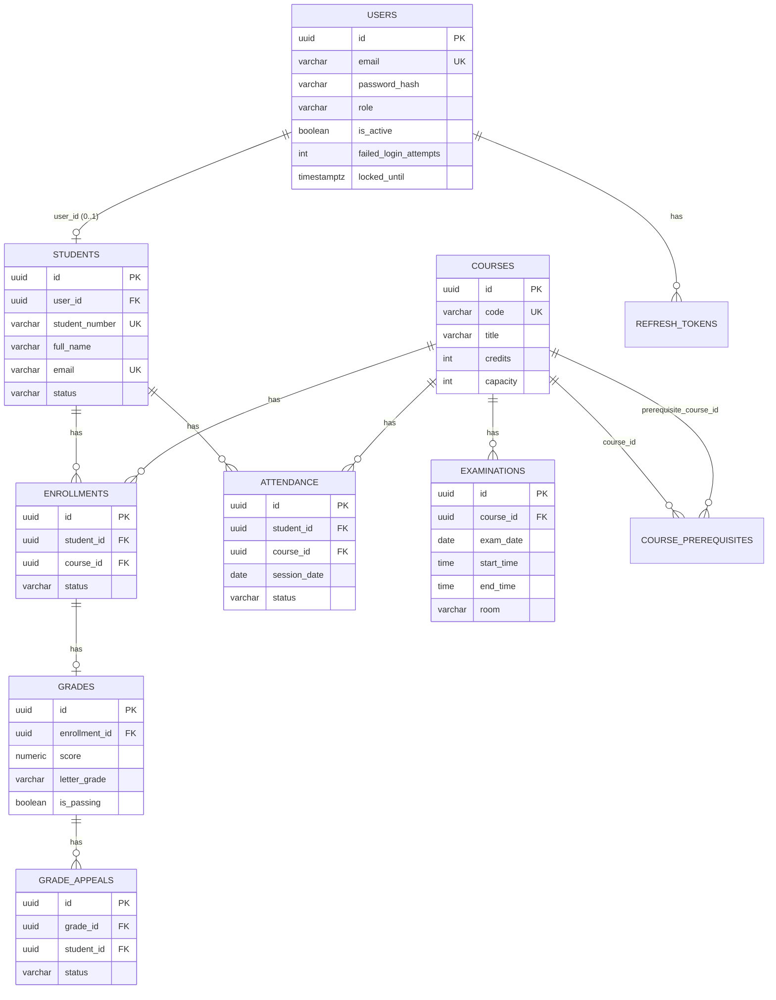
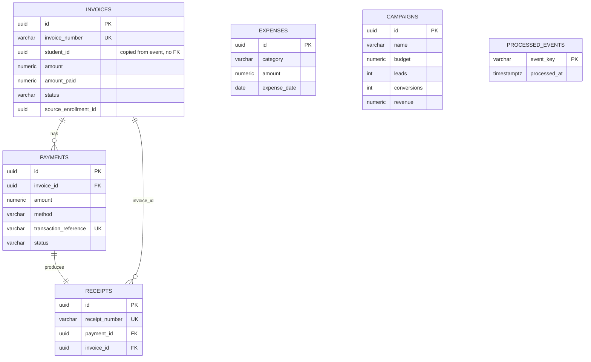
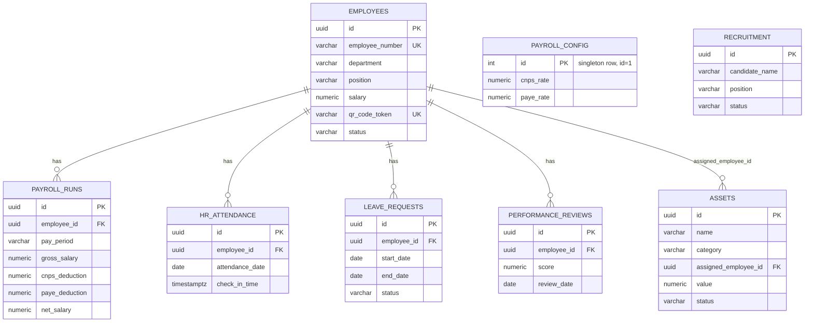

# Entity-Relationship Diagrams (per service database)

Database-per-service: `academic_db`, `finance_db`, `hr_db` are three
separate PostgreSQL databases with no cross-database foreign keys. All three
are normalized to at least 3NF; indexes are noted where added in each
service's `src/db/schema.sql`.

## academic_db

## finance_db

## hr_db

