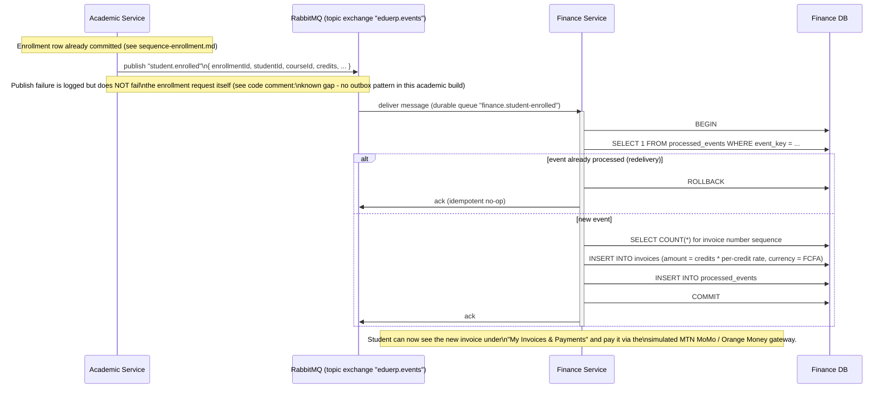

# Sequence Diagram - Enrollment -> RabbitMQ -> Finance Invoice (mandatory workflow)

This is the required asynchronous, cross-service workflow for the project.
It is implemented in
[services/academic-service/src/controllers/enrollmentController.js](../../services/academic-service/src/controllers/enrollmentController.js)
(publisher) and
[services/finance-service/src/services/invoiceService.js](../../services/finance-service/src/services/invoiceService.js)
(consumer), and is covered by automated tests in both services
(`tests/enrollment.test.js` and `tests/invoiceService.test.js`).

## Why this design

- **Topic exchange, durable queue**: survives a Finance Service restart -
  RabbitMQ holds the message until it is acknowledged.
- **Idempotency via `processed_events`**: RabbitMQ's at-least-once delivery
  means the same message can arrive twice (e.g. consumer crashes after
  processing, before acking). Without this guard a student could be billed
  twice for one enrollment.
- **Enrollment does not block on the publish**: a RabbitMQ outage should not
  prevent a student from enrolling. This is a deliberate trade-off - the
  known gap (an enrollment could be "lost" from Finance's perspective if the
  publish silently fails) is documented in code rather than hidden, and
  would be closed with a transactional outbox pattern in a production system.
