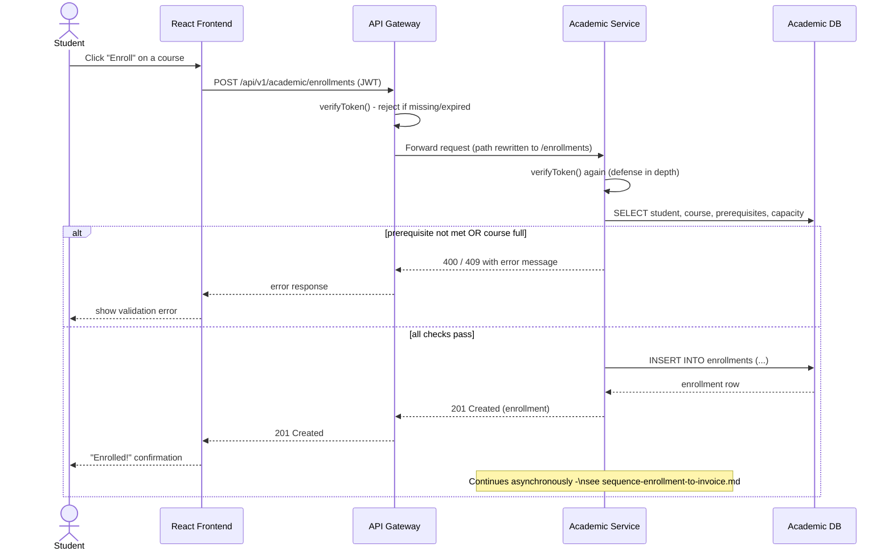

# Sequence Diagram - Student Enrollment (synchronous part)

```mermaid
sequenceDiagram
  actor Student
  participant UI as React Frontend
  participant GW as API Gateway
  participant AC as Academic Service
  participant DB as Academic DB

  Student->>UI: Click "Enroll" on a course
  UI->>GW: POST /api/v1/academic/enrollments (JWT)
  GW->>GW: verifyToken() - reject if missing/expired
  GW->>AC: Forward request (path rewritten to /enrollments)
  AC->>AC: verifyToken() again (defense in depth)
  AC->>DB: SELECT student, course, prerequisites, capacity
  alt prerequisite not met OR course full
    AC-->>GW: 400 / 409 with error message
    GW-->>UI: error response
    UI-->>Student: show validation error
  else all checks pass
    AC->>DB: INSERT INTO enrollments (...)
    DB-->>AC: enrollment row
    AC-->>GW: 201 Created (enrollment)
    GW-->>UI: 201 Created
    UI-->>Student: "Enrolled!" confirmation
    Note over AC: Continues asynchronously -\nsee sequence-enrollment-to-invoice.md
  end
```
