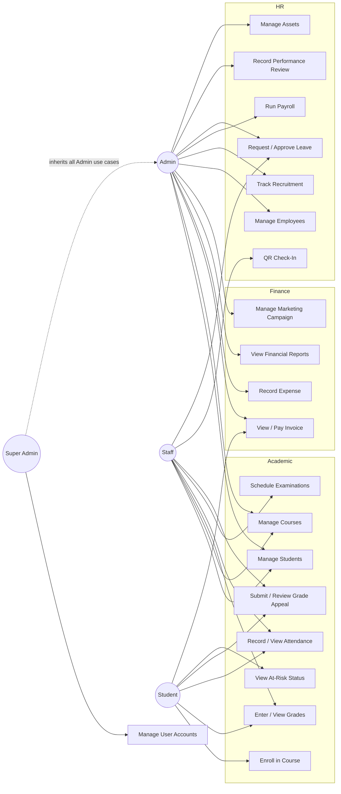

# Use Case Diagram

## Notes

- Enrolling in a course (UC3) is the trigger for the mandatory asynchronous
  workflow described in [sequence-enrollment-to-invoice.md](./sequence-enrollment-to-invoice.md):
  it always results in an automatically generated tuition invoice.
- `Manage User Accounts` (creating Admin/Staff/Super Admin logins) is restricted
  to Super Admin (and Admin, for Staff-level accounts only) - see
  `POST /api/v1/auth/register-staff` in the Academic Service.
